## 1、监听器、事件、任务、场景分析

## 2、监听器

### 1、执行监听

### 2、任务监听

## 3、事件

### 1、开始与结束事件

### 2、中间事件

### 3、边界事件

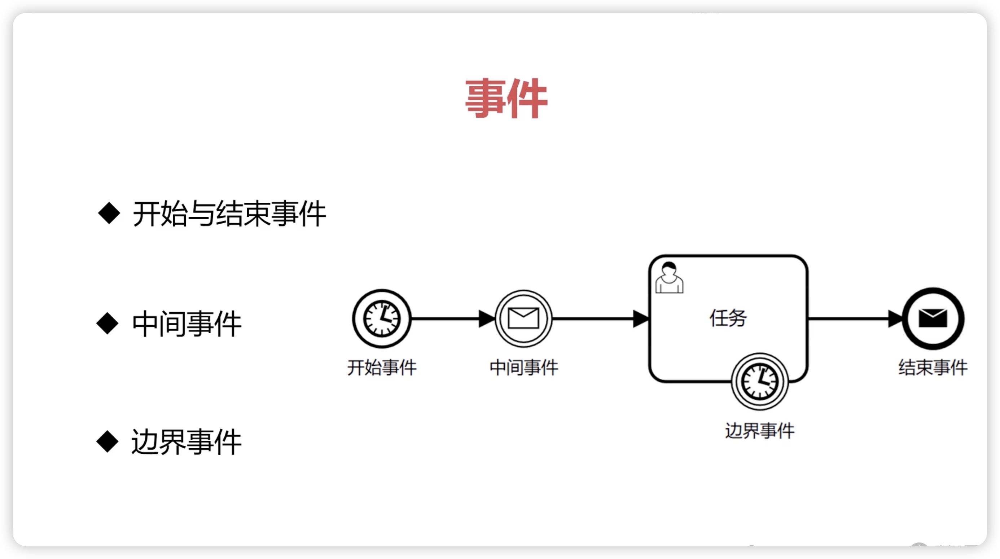

## 4、事件类型

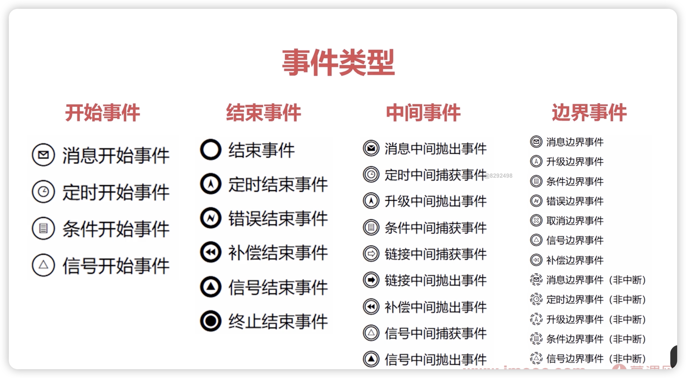

## 5、任务

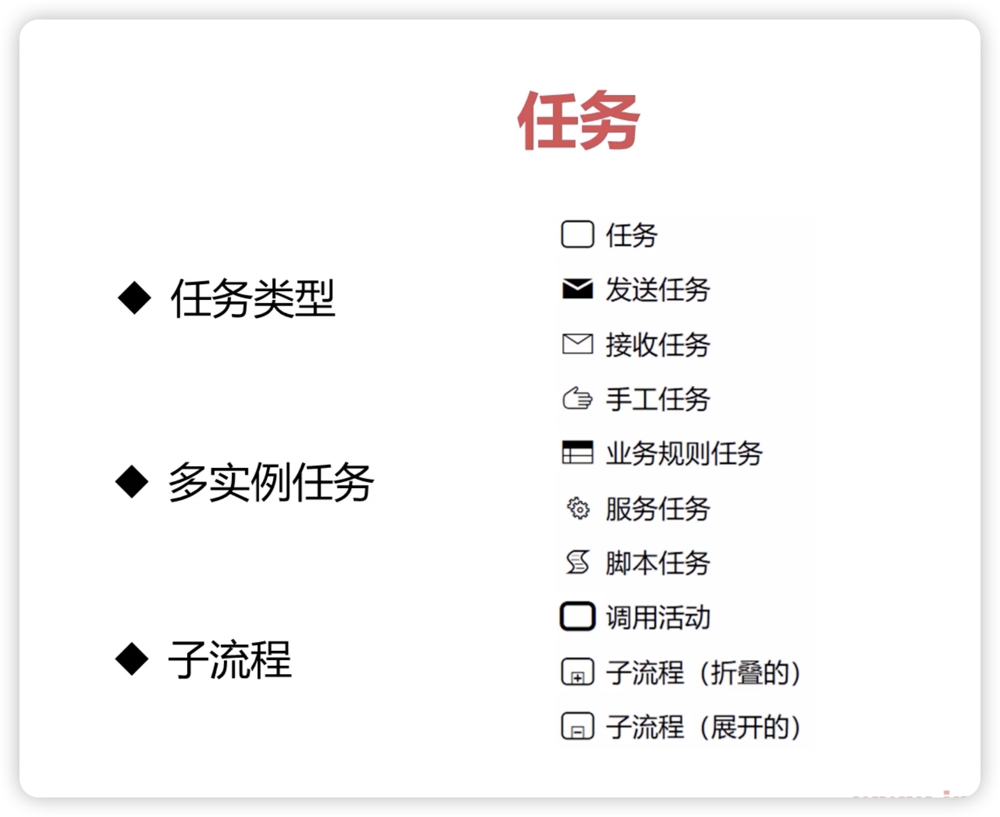

## 6、执行监听器作用

+ 存储读取变量
+ 处理业务信息

## 7、BPMN定时事件适用场景

+ 指定日期开启流程实例
+ 24小时任务未办理短信提醒
+ 3天未审核则主管领导介入

### 1、定时时间类型

+ Time date：日期，什么时间触发
+ Time duration：持续延时多长时间后触发
+ Time cycle：循环，循环规则

### 2、时间例子

+ 2021-08-30T15:23:59
+ 指定时间日期比较好理解，年月日和时间之间用T分割。

### 3、持续时间

| 持续例子                                                     |                             说明                             |
| :----------------------------------------------------------- | :----------------------------------------------------------: |
| P1DT1M - 一天一分钟执行一次     P1W - 一周执行一次     PT1H - 一小时执行一次     PT10S - 十秒执行一次 | P 开始标记     1Y - 一年     2M - 两个月     10D - 十天     T - 时间和日期分的割标记     2H - 两个小时     30M - 三十分钟     15S 十五秒钟 |

### 4、循环例子

+ 循环3次/开始循环时间/每次间隔：R3/2021-07-30T19:12:00/PT1M
+ 执行2次，1分钟执行一次：R2/PT1M
+ 无限循环/时间间隔/结束时间：R/PT1M/2021-01-01
+ 变量无限循环：\<timeCycle>R/PT1H/${EndTime}\</timeCycle>

### 5、典型的使用场景

#### 1、任务阻塞到时间满足条件

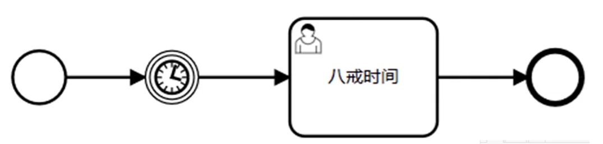

#### 2、超时任务他人介入 -- 非中断边界事件

+ 非中断会一直产生任务，使用服务可以发短信
+ 3天未审核则主观领导介入

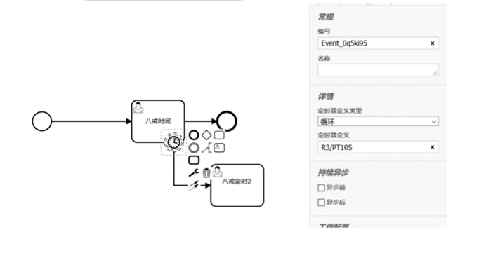

+ 这个时钟和下面的时钟区别是在这个时钟外边有虚线。
+ 超过指定的时间，八戒的任务会通知到他的主管这里，主管会存在一个任务，但是事件还是会存在八戒这里。
+ 八戒还是需要去办理的。
+ 八戒有任务，主管领导也是有任务的。
+ 下面这个情况没有虚线的时钟是主管直接帮八戒去办理任务。

#### 3、3天未审核则主管领导办理

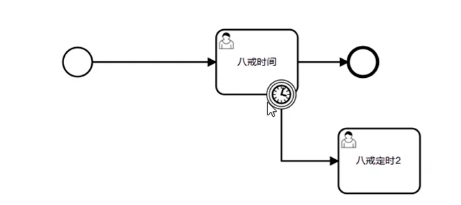

+ 任务到了八戒这里，八戒如果是经过若干时间没有审核，这个任务就不会再往下执行了。
+ 他就会自动执行到领导这里。
+ 这个时间可以使用边界时间，在任务上拖一个边界事件，设置事件去处理。

## 8、信号事件的捕获与抛出

+ 信号事件分为捕获事件和抛出事件

### 1、Catching捕获事件

+ 流程实例流转捕获事件之后一般会阻塞，等待别人触发它。
+ 触发的方式有两种，第一种就是使用抛出事件，将消息抛出出去。
+ 另一种方式是通过代码将时间抛出出去。
+ 捕获事件拿到了信号之后，继续执行。
+ 信号事件和后面的消息事件本质的不同是：信号事件是广播，消息时间是一对一通知。
+ 针对信号事件广播的特性，在实际业务中就有很多使用场景。
+ 信号事件的广播特性是同时通知全员出来搞事情的。
+ 实际业务中通常会把信号事件用在启动预案这样的环节，比如说台风有黄色预警，橙色预警和红色预警。
+ 不同的预警会有不同的预案来支持，预案就对应了不同的行动部门。

### 2、Throwing抛出事件

### 3、信号事件可以在哪里放置呢？

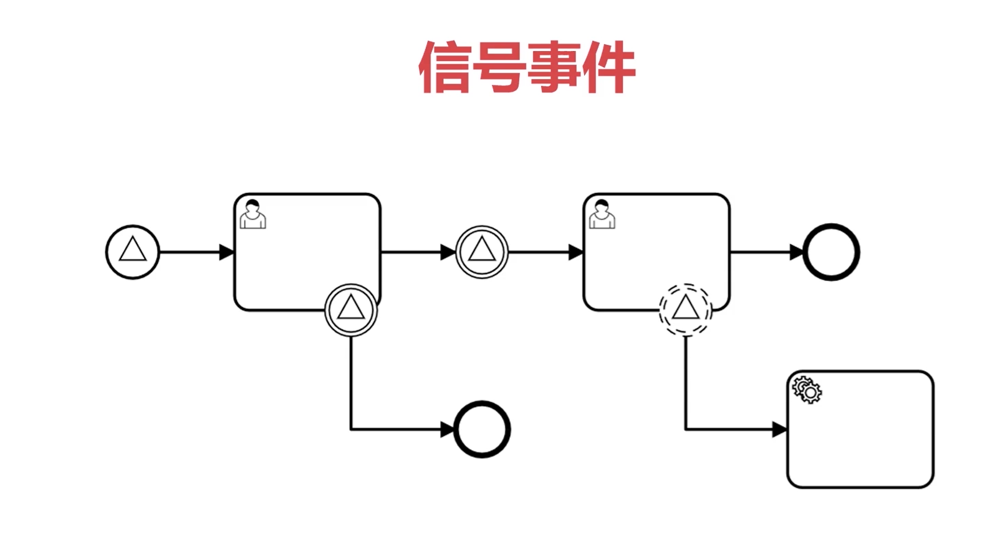

+ 首先开始时可以放的。开始放一个捕获事件，这是信号启动需要做的。
+ 并且信号事件可以放在边界事件。中间事件，以及信号事件还支持非中断，非中断一般会放置一个服务用来发短信。

### 4、配置启动信号事件

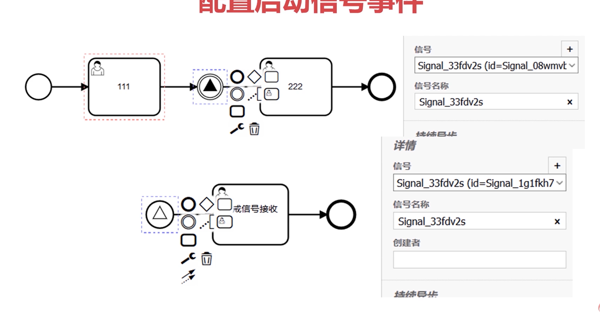

+ 这是一会要做的例子。
+ 首先上面和下面是两个不同的流程定义。
+ 信号事件的启动配置只需要在信号事件点击之后的面板中点击一下加号，BPMNJS会自动创建一个信号事件。
+ 在中间事件或者结束事件或者在监听事件中，都可以抛出信号，各部门收到信号之后开始执行预案里的工作。

### 5、信号事件代码触发

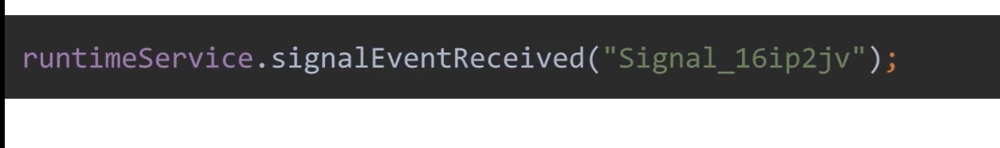

+ 代码就是这样的一个代码。参数就是信号的标识。

## 9、消息事件典型应用

> 消息事件和信号事件非常像，事件的类型、触发的方式都非常像。
>
> 唯一的区别是信号事件是广播，执行的时间只有一个参数，就是信号名称。
>
> 消息事件有两个参数，分别是消息名称和流程实例ID。
>
> 就是说消息事件每一次作用域只能是一个流程实例，信号事件是大喊一声，很多人很多人都能听见，消息事件是打电话，每次只通知一个人。

### 1、跨实例进行触发

### 2、跨任务进行触发

> 对于消息事件常用的一个应用就是撤回任务。这个应用场景是非常非常多的。
>
> 这个世界上是没有后悔药的，但是对于甲方来说，他就需要后悔药。
>
> 例如甲方A写了一份报告，提交给了领导，提交了之后发现报告里面是有错别字的，这个时候如果领导还没有审核，应该是有权限取回报告，并修改的，同理，微信都增加了撤回的功能，所以后悔药还是可以做的。撤回的功能有多种实现方式，有一些文章会选用直接操作数据库删除某些痕迹，这些代码一般都上百行，都非常的复杂。使用消息事件来做，就简单很多。

### 3、消息事件的类型

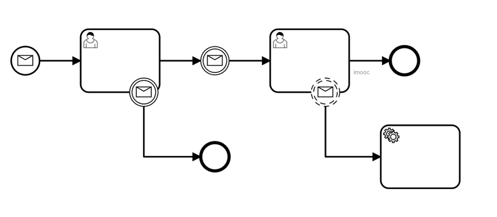

+ 可以是消息启动，消息中间，消息边界，消息非中断以及消息结束。
+ 但是消息启动跟时间启动一样。也是会报错的。这些问题都在官方github提交了，以后就看这人修复不修复。

## 10、错误事件

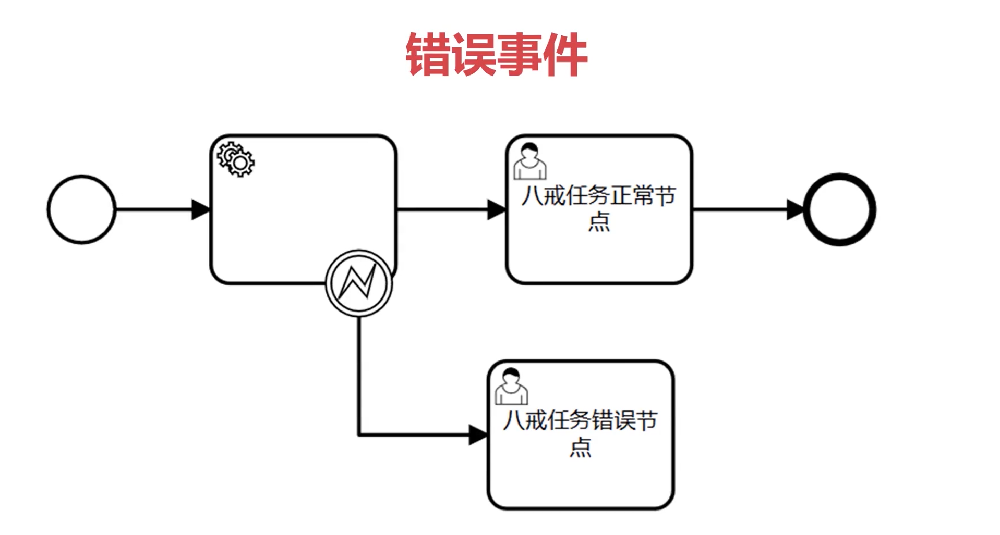

> 错误事件，就是发生了错误之后触发的事件，触发的条件也有两种。
>
> 一种是定义抛出事件，由捕获事件触发。
>
> 一种是定义捕获事件，由抛出事件触发，一种是由代码触发。
>
> 在实际工作中，使用错误事件的机会比较少。经常被拿来举例子的流程是：银行转账，网上购物你如付款环节，如果付款成功生成订单。如果付款过程中发生了错误，则询问是否继续付款并先返回付款流程。
>
> 实质和PPT中画的图类似，因为付款在银行调用环节是自动环节，如果成功了就是正常节点，否则就是错误节点。
>
> 错误事件由错误开始，错误边界和错误结束，错误开始是一个比较特殊的事件。

### 1、错误结束与开始事件。

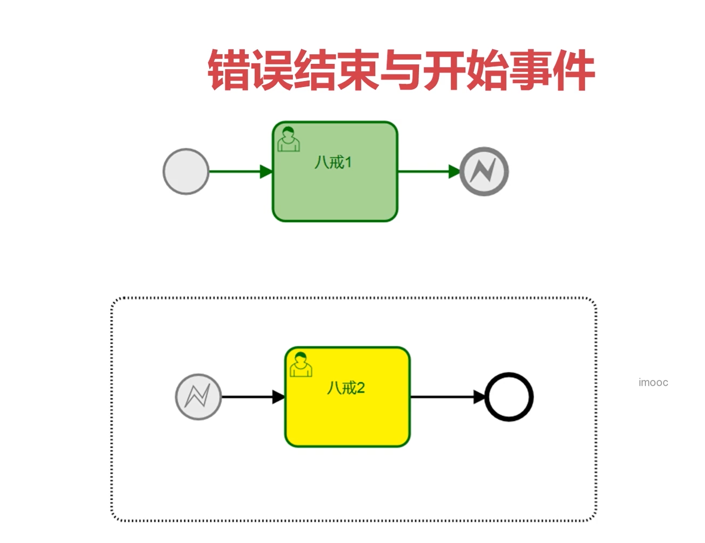

+ 错误开始只能放在事件子流程当中，他是不能够单独被做出来以及不能被单独在开始时间里设置的。
+ 只有在事件子流程的开始事件中才可以设置。

## 11、补偿事件和取消事件

> 为什么这两个事件要放在一起讲呢？因为这两个事件在activiti7 m4这个版本中都是不能正常执行的。
>
> 虽然不能正常执行还是有他的特点的。以及在业务中的用处。
>
> 以后出了Activiti7正式版以后，能够修复相应的Bug。补偿事件和其他所有的事件有一个缺点，其它的事件，比如定时事件，或者是消息事件去调任务走到当前节点，事件被触发。表里面就会增加一条数据，就是event_sub这个表环节执行过了之后，对应的事件就时效了，表里的事件就会被删除。
>
> 补偿事件跟它们的区别是，补偿事件走到的环节会触发，环节执行过了，到后面的环节了，意图为例。

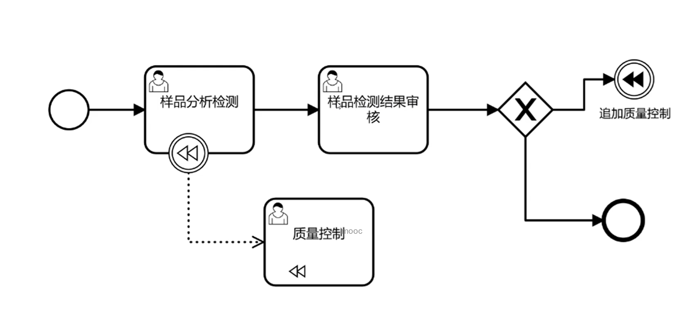

> 走到样品检测结果审核环节了，补偿事件还会再表里面出现，还是激活状态，一直要到整个流程实例结束他才会结束。
>
> 这是他的不同，那么补偿事件有什么作用呢？是说走到当前的环节并不需要做什么事情，那是在后面的某一个时刻发现当时做的事情不够，是需要补偿的。这个时候就会执行补偿事件。
>
> 举一个实际业务的例子，实验室的分析员，领到了一些土壤的用品，他进行分析，分析了之后，奖结果拿给质量控制人员去审核，质量控制人员会做出判断，如果他认为这次的审核结果不够精准，他就会走追加质量控制的环节，在样品分析检测环节，分析员可能只填了分析结果的相应内容，如果追加了质量控制，就会补偿质量控制环节，他可能会去取一些已经知道结果的土壤样品。如果说立马要得到的结果和实际的结果是一样的，那么就说明他之前的土壤分析结果也是正常的。
>
> 这就是补偿事件的一个典型使用。

### 1、补偿事件的特点

+ 任务到达时激活

+ 流程实例结束时挂起(其它事件任务结束时挂起)
+ 子流程需要任务到达补偿节点才能激活，而非子流程开始就激活。

### 2、取消事件

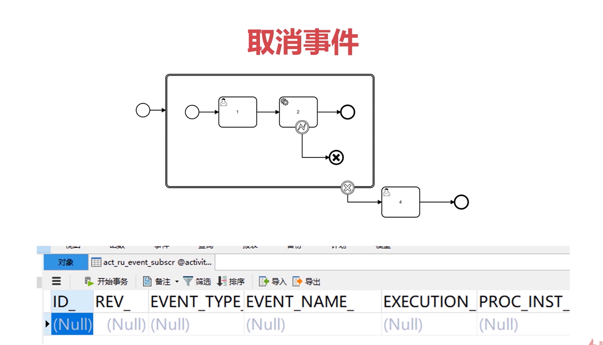

> 取消事件在Activiti7-M4版本中，也是不能执行的。这个截图就是activiti存事件的表，当添加了取消事件并且启动了之后，流程实例是可以启动的。但是取消事件明显没有在表里面显式任何数据。所以肯定是不会去写的。

## 12、手工任务

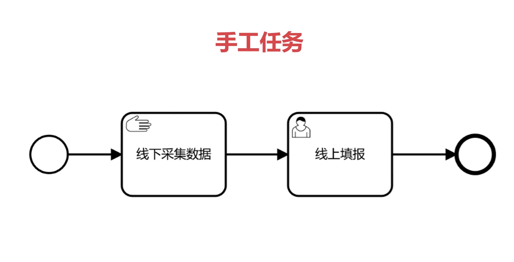

> 手工任务的作用是在系统中留痕迹，手工任务实际上不会做任何代码处理，直接通过，那为什么还要用手工任务呢？
>
> 在实际的业务中，甲方经常会说，这些事情线下去办，这些事情员工处理。员工去办和线下处理到底要不要在系统里面体现出来呢？
>
> 肯定是需要体现出来的。
>
> 因为线下去办和人工处理的环节确实是属于系统的一部分，如果不体现出来很有可能以后会忘掉。
>
> 例如企业的污染源监测数据就分为在线监测和手工监测，那么手工监测需要线下才去处理并写在业务系统中，通过上传Excel导入的方式，上传到系统。
>
> 这个时候手工任务就能体现他的价值了。
>
> 总结就是手工任务在Activiti中不做任何处理，是用来留痕迹使用的。

## 13、脚本任务(scriptTask)

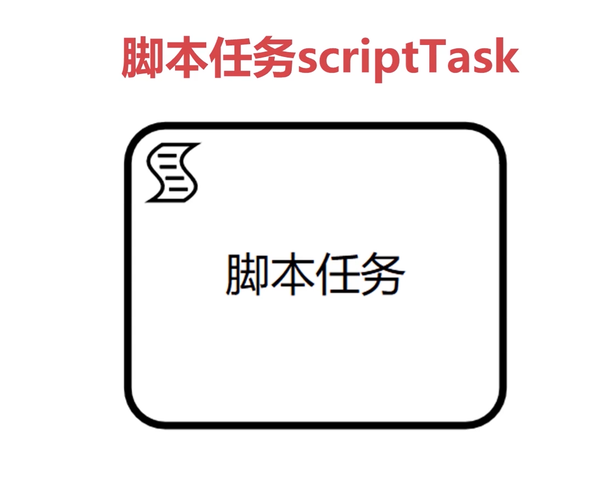

> 使用脚本任务可以在不重新发布任务的情况下，进行一些简单的操作，如果要用的话，一般会用在变量的取值和赋值，但是实际业务中，脚本任务既没有代码提示，也没有报错提示。很容易出错。并且脚本任务完全可以通过任务监听、执行监听和服务任务甚至边界事件触发的事件去代替。所以实际项目中基本上没有脚本任务。

## 14、业务规则任务

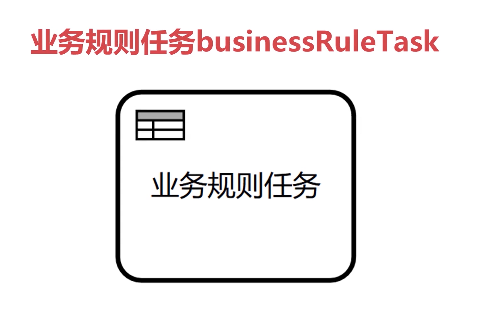

> 业务规则任务与脚本任务非常类似，他们的目的都一样，在不重新发布项目的前提下通过BPMN相关配置改变业务逻辑。业务规则任务还需要使用另外一套规则引擎，要导入一套新的jar包，学新的语法。开发中也不会用到，做了解即可

## 15、接收任务

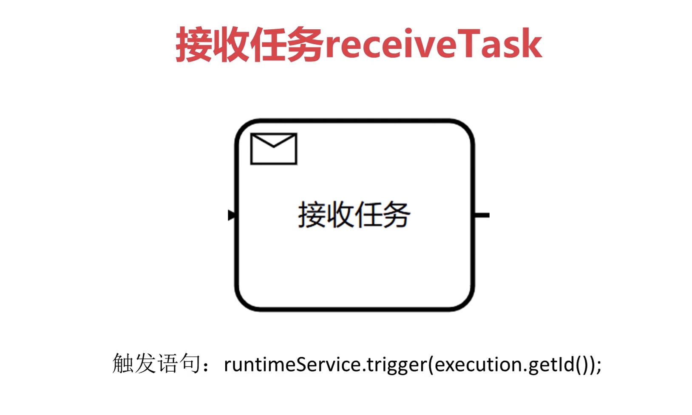

> 接收任务很类似消息中间事件，任务走到接收任务环节，会发生阻塞，可以使用代码runtimeService.trigger(execution.getId())，传入环节ID进行触发。

## 16、发送任务

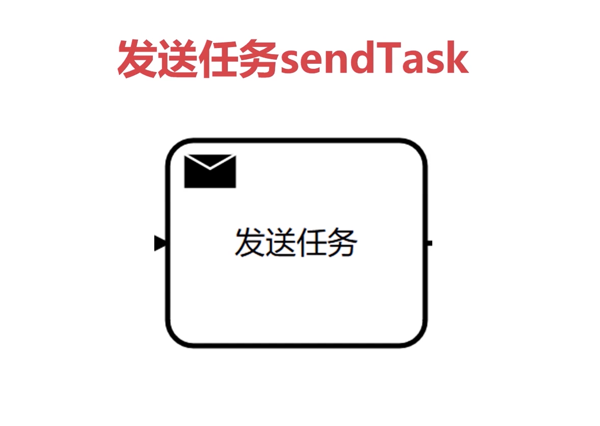

> 发送任务以前还有邮件任务，现在在BPMNJS中去掉了，因为实际上要做邮件发送肯定是通过一个服务任务调用自己写的发邮件功能，去发送邮件，而不是用Activiti自带的发邮件功能。发邮件的方式有很多，通过第三方的类库去发，通过自己搭建的邮件服务器去发，在服务任务中去调用自己写的发送邮件要比自带的发送邮件更有实用性。
>
> 另外发邮件是一个很重的代码，activiti7基于轻量化引擎考虑，去掉了发送邮件，那么发送任务和接收任务并不是一一对应的，也不会触发。并且没有找到相关的说明。做了解即可。

## 17、服务任务

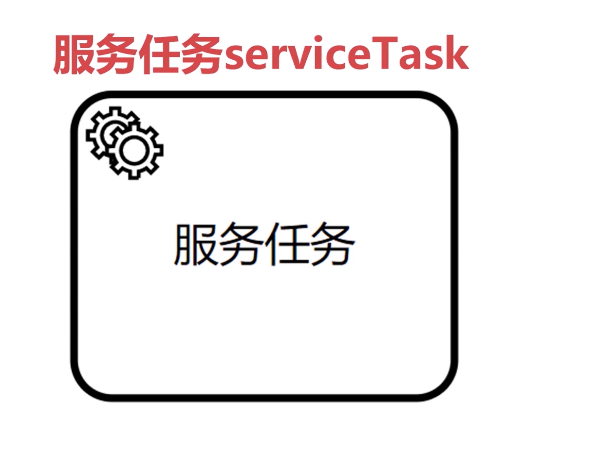

> 服务任务对任务来说，使用频率从高到低排序，第一是用户任务，第二就是服务任务了。第三是手工任务。其他的任务大部分情况下是不会使用的。

### 1、服务任务使用场景

> 由于服务任务是用来触发Java下的类自动执行某些功能的，和监听非常类似，所以一般用来发短信，发短信，调用其他接口。

+ 发短信
+ 发邮件
+ 调用其它接口

### 2、服务任务的注意事项

+ 自动执行
+ 需要执行类
+ 执行必须继承JavaDelegate接口

## 18、子流程类型

### 1、嵌入子流程

> 嵌入子流程与主流程在同一个BPMN中绘制，他的作用主要是用来区分功能块，比如前半部分是别的部门处理，后半部分是研发部这里。最后是运维部处理。就可以将他们放在不同的子流程中。

### 2、调用子流程

> 调用子流程，主流程与被调用的子流程在不同的BPMN中，主要使用的场景是被调用的子流程可以复用，例如公司的报销，不管是研发部报销还是方案部报销，对于财务来说都是由财务报销，出纳，打款。这个时候财务部的流程就可以做成调用子流程。在不同部门报销中进行调用不需要重复绘制，减少工作量，剩下的事件就可以一边喝茶，一边做其他事情了。
>
> 总而言之，嵌入子流程，这种子流程一般作为局部通用的处理逻辑，使比较复杂的单个子流程里面的逻辑更加清晰，嵌入子流程其实还是原来的流程。
>
> 调用子流程可以通过一些外部的流程作为调用主流程的外部调用流程，供其他多个主流程进行复用。并且可以根据UEL表达式参数动态加载不同的子流程。

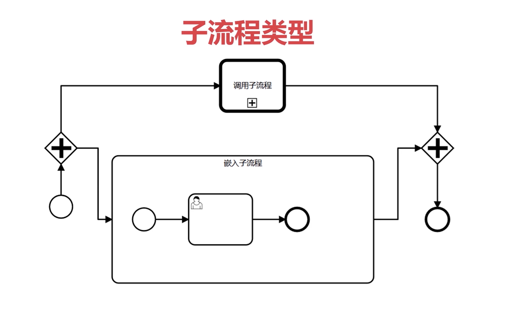

> 这里用BPMNJS花了一张图，上半部分是调用子流程，可以看到一个+号，具体调用了那些子流程可以在属性面板中配置。
>
> 下半部分是嵌入子流程，子流程都有自己的开始与结束节点，调用子流程点击之后，属性面板在调用活动类型选择BPMN之后，调用元素就是外部BPMN的名字，这个外部BPMN列表部署了之后，才可以在主流程中调用。主流程和调用子流程可以通过参数

## 19、多实例任务

+ 会签(并行)

> 会签是业务系统中非常常用也比较典型的一个应用。一般的OA系统中，对于收文发文这些重要的操作都有会签

+ 多子流程业务(并行)

> 例如实验室管理系统，在外出人员采集到样品，回到实验室后，一般会由不同的实验室去领取样品进行分析，实验室分为水科，系科，土壤科等等，他们每一个科室都需要进行自己科室的领取样品，化验样品，质量控制和质量审核，生成报告，这个时候就需要多实例子流程了。

+ 动态顺序审批(串行)

> 在流程图上可以拖动ui页面绘制用户任务，A审完，B审，B审完，C审，这些人员如果你在页面上拖动三个环节，那么固定就是这三个环节审核。如果有一种需求说，我现在不知道这个事，需要几个人审核，也许这一次是两个人，下一次是五个人。这个时候就需要使用多实例任务的动态顺序审批。

### 1、多实例任务完成条件

> 多实例任务自带的三个参数，多实例任务完成条件是干什么用的呢？市级审批过程中，因为之前讲的审批说的都是通过或不通过，在多实例中，它其实是通过百分比的概念，可以将其理解为投票。
>
> 例如现在十个人参与会签，只要有一半的人会签通过，整个任务就算通过，这个时间就要使用任务完成条件。
>
> 还有一种情况是一票否决

+ 总实例数：nrOfInstances
+ 当前还没完成的实例：nrOfActiveInstances
+ 已经完成的实例个数：nrOfCompletedInstances

> 大多数情况下会使用已经完成的实例数除以总实例数，这个就是一个百分比，这个百分比大于0.5就是超过百分之五十的人通过。

## 20、多实例任务设置详解

