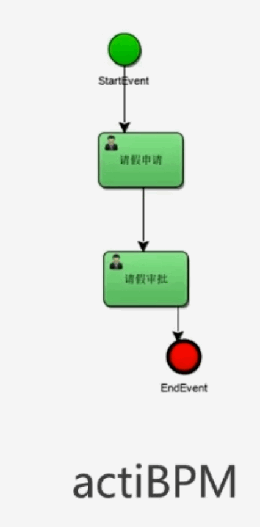
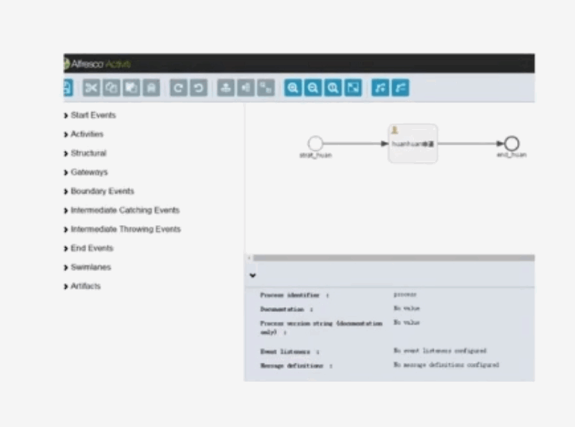
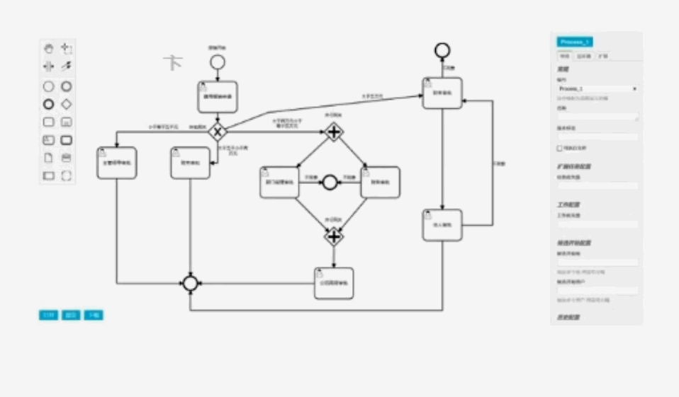

## 1、IDEA中BPMN绘制插件与请假流程制作

+ IDEA绘制BPMN2.0拆件actiBPM
+ 安装了之后默认不支持中文，是会存在乱码的。
+ 解决绘制中文乱码问题

## 2、绘制BPMN的工具对比

### 1、avtiBPM

+ 这个是用插件去绘制。
+ 它的好处就是你想什么时候绘制，你在IDEA里面随时画，非常的方便。
+ 它的问题就是因为他的版本比较老了，官方也就不维护了。
+ 在中文支持上需要配置并且执行人这个字段配置了之后再打开其实是看不到的。
+ 但其实它是配置成功了。

### 2、activiti explorer

+ 这个是activiti官方5和6版本官方提供了叫做activiti explorer.
+ 他是一个基于web的绘制工具。
+ 功能也是比较强大的。
+ 但是页面来说是相对比较丑。

### 3、BPMN-JS

+ 这个是activiti7推荐的绘制工具。
+ 它是BPMN-JS。
+ 他不管是从页面绘制的效果还是操作来说都更加的现代，更加的流畅。
+ 后面会主要去讲BPMN-JS如何集成到工作流引擎中。