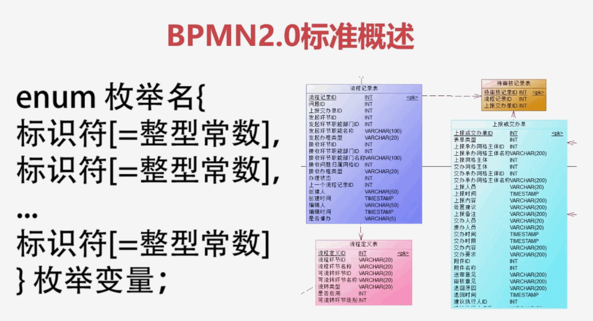
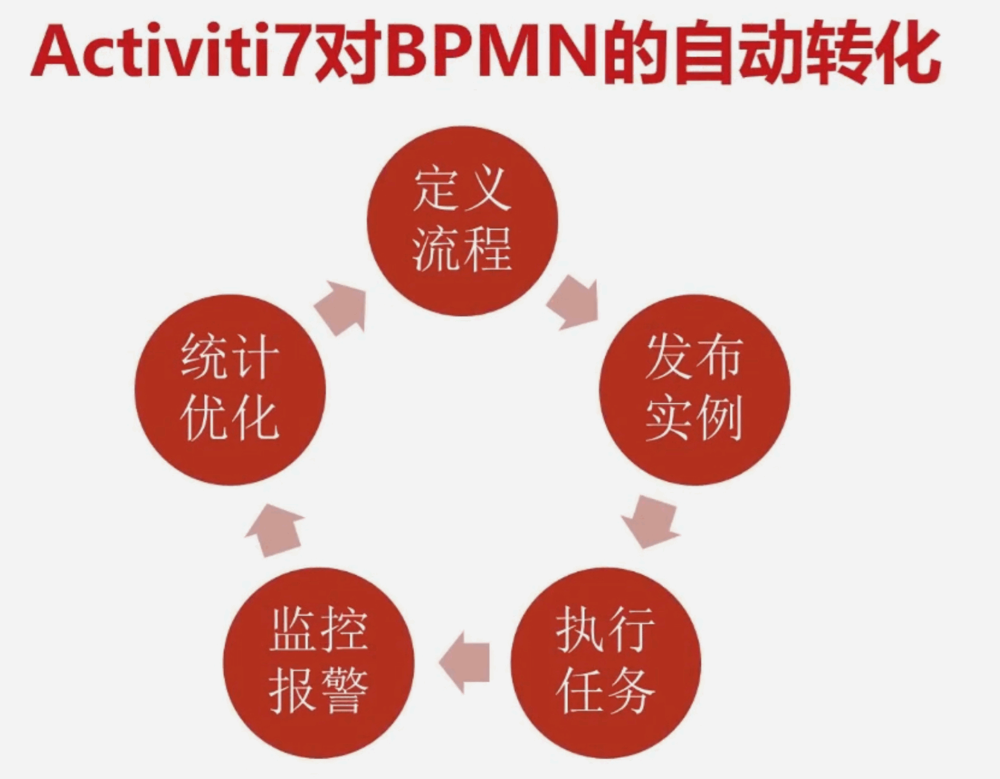

## 1、Activiti7介绍

### 1、Activiti项目是基于Apache License许可的开源项目

### 2、Activiti项目的前主管Tom Baeyens，2010立项

+ Activiti一共是存在三个版本5,6,7
+ 因为Activiti的前身是JBPM
+ 基于JBPM开发出来的引申产品，所以Activiti初始版本号就是5.

### 3、Activiti项目支持BPMN标准

+ 通过过各个行业都有行业协会和行业标准
+ 例如汽车行业，国内的方向盘都在左边，都是四个轮子。
+ 排量也有一定的要求
+ 在工作流里面比较权威的标准就是BPMN2.0规范
+ 基于这个规范的出现，广大开发者都可以做通用的工作流引擎。
+ 工作流解析页面。
+ 各家的工作流引擎在很大程度上可以通用。
+ 节省社会资源，学习成本，流程转化的成本

### 4、与SpringBoot更好的原生支持

+ 旧版的Activiti需要配置activiti.config.xml文件
+ 在启动的时候还需要手动加载xml。
+ 整合后的Activiti7只需要和SpringBoot配置相同的yml文件就可以了。
+ 同意的配置入口方便管理

### 5、引入SpringSecurity作为默认用户与角色的默认安全机制

+ 之前没有默认的安全框架机制，用户可以自行添加。其实这么做相对比较灵活。
+ 而在新版的代码里强制使用了SpringSecurity。
+ 并在调用api的时候默认使用SpringSecurity身份验证
+ 总之要使用新的api的话就必须使用SpringSecurity作为身份认证。
+ 随着SpringCloud的广泛使用。
+ SpringSecurity一定会成为最流行的安全框架。
+ 所以学习SpringSecurity是很有价值的。

### 6、核心API进行了封装

+ 原有七大类API进行封装
+ 封装后的接口进行了null值判断，异常判断等操作。
+ 让广大的开发人员把更多的精力投入到业务流程上。

### 7、对云发布、分布式支持等等

+ 由于要支持分布式，云原生
+ Activiti7轻量化引擎去掉了用户和表单两个接口类
+ 这两个部分需要自己手动编码实现。

## 2、Activiti7新特性介绍


+ 关于新版的api封装，对于编码的变化，相比原来还是比较大的。
+ 原来是说左侧的几个类。
+ RuntimeService，ManagementService，TaskService，HistoryService....
+ 现在被封装成了两个类：ProcessRuntime和TaskRuntime
+ 并且废弃了最左边的表单类和用户类
+ 课程会讲解经典api的写法和Activiti7最新的写法。

## 3、工作流常见业务场景介绍

### 1、线性审批


+ 对于线性审批，使用枚举或者int类型进行标识变量
+ 配合if...switch语句就可以实现。
+ 确是对于明确需求的简单流程，后期确定不会有大的业务变化。
+ 自己编写判断条件，可能是一种更好的选择。

### 2、会签审批


+ 例如部门需要对外发布公文这个流程
+ 公文属于比较重要和正式的行为。
+ 起草后需要多人审核。多人审核通过后才能进行下一个环节。
+ 这种复杂的流程，自己编写控制代码。
+ 代码量就需要呈几何倍数的增长了。

### 3、条件流程


+ 这种是根据不同的条件去进行不同的分支。
+ 例如是请假流程。
+ 请加小于三天，部门经理审批就可以
+ 请假大于三天，需要公司领导审批
+ 根据不同的判断条件，进入不同的流程。
+ 也是一种常见的业务流场景。

## 4、BPMN2.0简介

### 1、BPMN

+ 业务流程建模标注
+ Business Process Model and Notation
+ BPM的出现弥补了从业务流程设计到流程开发的间隙

### 2、OMG

+ 国际性的、开放式会员制的非盈利技术标准联盟(The Object Management Group)
+ BPMN是OMG国际标准组织于2011年推出的BPMN2.0标准
+ OMG的定位是对象管理组织，成立于1989年
+ 是一个国际性，开放式会员制的非盈利技术联盟
+ OMG由企业学术机构和政府组成，BPMN2.0支持强大的可视化设计，执行和维护流程
+ BPMN2.0标准的制定，统一了业务流程描述文件，业务流程符号
+ 使不同企业能够在先沟通的标准下进行交互开发
+ 极大的推进了行业进步。


+ 不同的收集充电口差别是很大的。
+ 不同的收集生产商都有自己的充电口标准。
+ 导致的结果是什么呢？
+ 首先充电器不能通用，其次消耗大，充电设备不能复用，造成资源的浪费
+ 现在安卓的收集基本是type-c，新出的笔记本电脑也都是这个接口。
+ 苹果从2012年开始使用的是lighting接口。
+ 同理作为流程系统，实现的方案有很多。
+ 简单的做法可以使用枚举字段来表示流程任务节点
+ 并在代码逻辑判断下一步执行的环节。



+ 也可以设计一些流程定义表，流程执行表，日志流程表，实现业务的流转。
+ 那问题是什么呢？就和早期的手机接口一样。
+  那些需要工作流的公司自己开发一套标准。
+ 学习成本高，不通用。
+ 工作流不只是业务的流转，完善的工作流还需要可配置页面的支持。
+ 由于工作流描述文件不一样，
+ 很难出现高复用或者是很好用的工作流绘制页面。
+ 所以工作流一直是业务系统公司开发的一个痛点与难点。
+ BPMN2.0规范的出现解决了这个问题。
+ BPMN是独立于企业的标准
+ 实际上BPMN主要包括的两部分。
+ 对绘制业务流程图标的定义。说明流程的含义。


+ 更重要的是对业务流程描述的定义。
+ 在BPMN2.0中，业务描述通常是xml文件。
+ 里面描述的流程内容，包括流程的图标，类型，描述，流程等等。
+ 基于统一标准的BPMN2.0规范。
+ 各大厂商开发了很多好用的插件。
+ 在同一的标准下执行业务流程的绘制，部署，发布，流转，统计的功能。

## 5、BPMN2.0图常用工具解释

### 1、StartEvent

+ 流程开始节点

### 2、EndEvent

+ 流程结束节点
+ 一个流程有且只有一个开始节点。
+ 但是可能会存在多个结束节点。

### 3、UserTask

+ 这是任务，每一个流程可能会存在多个任务。
+ 当然除了用户任务还有其他的一些任务
+ 比如说ServiceTask，MailTask
+ 其他的任务一般来说是需要指定功能的时间使用的。

### 4、ParallelGateway

+ 并行网关
+ 网关分四大类，包括并行网关，排他网关，包含网关和事件网关

### 5、SubProcess

+ 子流程，子流程一般使用在两个环节
+ 对于主流程过于复杂，我们可以在某个环节上使用子流程
+ 在子流程所有的任务都流转完了之后，再回到主流程来流转。
+ 还有一种典型的使用场景是，不同的流程里面。
+ 有相同的主流程。这个时间就可以把相同的子流程提炼出来。
+ 而不用每次都重复画子流程。
+ 节省绘制流程图的时间，提高效率。

### 6、Pool

+ 泳道
+ 可以将不同的角色放在不同的泳道里。
+ 明确每个角色所在的位置以及流程的流转内容。

### 7、BoundaryEvent

+ 边界事件
+ Activiti7支持丰富的各种事件。
+ 能满足实际工作中不同的业务需要。

## 6、Activiti7对BPMN的自动转化



+ 可以使用IDEA将标准的BPMN2.0业务图发布为实际的业务工作流。
+ 支持业务的流转，完整的业务过程有
+ 定义流程 -> 发布实例 -> 执行任务 -> 监控报警 -> 统计优化
+ 在开发阶段，IDEA中安装了BPMN2.0插件后。
+ 就可以绘制与保存BPMN2.0图。


+ 这与BPMN2.0的js图片是可以通用的。
+ 使用activiti引擎可以将bpmn2.0业务图解析出来，自动创建对应的业务流程表。
+ 并使用封装好的代码，能方便的对业务流程进行流转。

## 7、SpringBoot与Activiti7整合


+ 首先是要介绍一下Activiti7以前使用xml的形式怎么配置Activiti项目。
+ 其次要在pom增加pom的引用。
+ 这里非常非常重要的是使用的版本是M4。
+ 最后Activiti7默认自动创建表，是不会创建历史数据表的。
+ 那么会在yml文件中进行相关配置，使历史数据表可以显示。
+ 再下来可以看一下Activiti7自动创建了哪些表。
+ 最后还是要执行user.sql。
+ 这个sql主要有两个功能。
+ 第一是修复Activiti M4缺少字段的BUG
+ 另外是创建某一个用户表
+ 用户表在本章是用不上的。但是在下一章节整合SpringSecurity的时间。
+ 从用户表里面查询用户信息。
+ 接下来就开始操作。

## 8、Activiti版本使用M4

```xml
<dependency>
    <groupId>org.activiti</groupId>
    <artifactId>activiti-spring-boot-starter</artifactId>
</dependency>
<dependency>
    <groupId>org.activiti.dependencies</groupId>
    <artifactId>activiti-dependencies</artifactId>
    <version>7.1.0.M4</version>
</dependency>
```

+ 7的版本从M5开始会自动 

```sql
insert into ACT_RE_DEPLOYMENT
```

+ 一条SpringAutoDeployment
+ 你每一次启动项目，并且每一次执行部署的时候，他都会加。
+ 但是这一条数据是没有用的。
+ 他会严重影响开发和使用。
+ 经过测试M4版本就没有这个BUG。
+ 所以使用M4版本。

## 9、Activiti7经典类

+ Activiti中有五个经常使用的类
+ 分别是流程部署Deployment
+ 流程定义ProcessDefinition
+ 流程实例ProcessInstance
+ 任务处理Task
+ 以及是历史任务HistoricTaskInstance

### 1、Deployment类


+ 首先是需要绘制一个BPMN图
+ BPMN图需要指定流程的key。
+ 指定流程的名称
+ 制定流程的执行人
+ 在实际项目中实际上会通过编码上传bpmn，但是本节课的重点是deployment类。
+ 因为上传本身的代码也相对多一些，所以这次来指定路径来部署BPMN。
+ 部署了之后会进行流程部署的增删改查
+ 以及流程部署在实际项目中还会将他查询成xml。以及bpmnjs
+ 在页面中重新展示。
+ 这些都会在随后的课程中意义讲解。

## 10、流程定义ProcessDefinition

### 1、Deployment

+ 添加资源文件、获取部署信息、部署时间

### 2、ProcessDefinition

+ 获取版本号，key，资源名称，部署ID等
+ Deployment和ProcessDefinition有相同的地方还有不同的地方。
+ 这两张表是一对一的表，这两张表是主外键关系。
+ 那么什么时候会做主外键关系呢？
+ 一般是一对多的时候才做主外键关系。一对一的时候原则上是不做主外键关系的。
+ 但是activiti在一对一的情况下还是做了主外键关系。
+ 无非就是两种情况，他想这两个类型完全不一样，它做主外键。
+ 另外就是列太多，它做主外键。
+ 但是实际来说，这两种情况都不满足。
+ 为什么不把Deployment和ProcessDefinition不做在一个表里面而是做到两个表里面呢？
+ 解答是Activiti的程序员就是这么设计的。
+ 但是这么设计是有点麻烦的，就是如果要查询数据还需要从两张表里面查。
+ 通过不同的类去查。
+ 不能从一个类获取两个。这个还是挺麻烦的。

### 3、Deployment和ProcessDefinition的关系

+ 是什么关系呢？
+ 他们其实做在一张表里面是完全没有问题的。
+ 但是是设计成了两个表。
+ 他们描述的信息都是流程定义，发不上去之后，对应的资源文件，版本号等等信息。
+ 说明他们描述的都是流程定义。
+ 一个叫部署，一个叫定义。

## 11、流程实例ProcessInstance

### 1、ProcessDefinition与ProcessInstance是什么关系？

+ 是一对多的关系
+ 理解为：行动计划与具体行动的关系
+ 它就相当于你定义了一个类，定义了一个学生类，这个类里面有学生的名字，name，年龄，age
+ 这个类就相当于是流程定义。
+ 那么流程实例是什么呢？
+ 一个代码里面每一个new，每一次new学生类，他就是一次流程实例。
+ 所以流程实例与流程定义是一对多的关系。
+ 如果这个概念还是不好理解。
+ 流程定义就是已制定的行动计划，他是一个方案。
+ 流程实例是每一次的执行这个方案，执行这个行动。
+ 上班是一个方案，上班的路线是一个方案，那么每天都要去上班。
+ 每天的行动都是一个流程实例。
+ 总的来说流程定义与流程实例是一对多的关系。
+ 流程实例是流程定义的具体实现。

## 12、任务的类型

### 1、用户任务等...


+ 说到任务类型，这个是在BPMNJS里面截的图。
+ 任务类型有用户任务，发送任务，接收任务，手工任务，业务任务，服务任务，脚本任务，调用任务，子流程....
+ 任务的图形化是以矩形为基础，在左侧添加具体的图标。
+ 用来描述一种特定的任务类型。
+ 这里面最重要的就是用户任务了。
+ 因为其他的任务他其实是一个锦上添花的功能。
+ 就算没有其他任务类型，也是完全可以通过编码的形式来实现相应的功能。
+ 本节课先把基础打好。
+ 主要来讲用户任务，而其他的任务类型。
+ 会在后面的高级应用里面讲解。

### 2、用户任务的属性面板


+ 左侧这张图画红框的位置就是常用的四个设置，分别是什么呢？

#### 1、Assignee

+ 执行人/代理人
+ 如果明确了下一个环节只有一个人来执行，就可以设置这个字段。
+ 这个可以是固定的，可以是不固定的。
+ 下一节课讲流程变量里面就可以知道怎么用流程变量来控制。 

#### 2、Candidate Users

+ 候选人
+ 顾名思义，比如说有几个人要参与竞选，那么参与竞选的几个人就是候选人了。
+ 候选人中敬酒谁能胜出呢？不知道，只有在实际结果出来的时候才知道。
+ 在这里的候选人顾名思义，候选人一般要是设置多个用户的。
+ 那么具体谁来执行这个环节呢？
+ 那是要看每一个候选人优先拾取了这个任务。那个候选人实际上就变成了执行人。
+ 在这里一般是可以设置多个候选人。
+ 那如果说是设置一个候选人行不行呢？也可以，但是并没有什么意义。
+ 如果你只设置一个候选人不如设置一个执行人。
+ 候选人如果是多个，中间用英文的逗号隔开。

#### 3、Candidate Groups

+ 候选组
+ 既然是候选组，也就是说用户要归属于某一个组。
+ 比如说员工组，领导组，财务组
+ 那么如果说一个组里面有很多人，就不用一个一个的去设置候选人了。
+ 而是把这一组用户直接赋值在用户组里头。
+ 但是Activiti7以前他默认这个框架是带用户管理的。
+ Activiti7轻量化这个框架去掉了用户管理和表单管理。
+ 所以候选组这个选项在Activirti7中被弱化了，而实际上也可以通过代码将候选组的用户在前端页面上批量传给候选人。
+ 其实也是可以打到候选组的效果。

#### 4、Due Date

+ 任务到期时间
+ 这个属性是干什么用的呢？
+ 任务Activiti工作流中有一些边界事件。
+ 什么叫做边界事件呢？
+ 就是夹在任务旁边某些条件达到能自动触发的事件。
+ Due Date任务到期时间主要是用来自动触发定时任务等等的边界事件而设置的。
+ 主要的使用场景是如果一个员工申请了报销。
+ 它的主管领导很有可能这阵子也出差了。
+ 就可以设置如果三天没有审批，那就直接到财务。
+ 因为它的主管领导这个环节的审批其实是作为一个辅助意见。
+ 这个时间我们就可以设置任务到期时间。

## 13、查询历史记录

### 1、历史综合信息

+ HistoricTaskInstance

### 2、历史变量

+ HistoricVariableInstance

## 14、UEL表达式

### 1、EL为表达式语言(Expression Language)

### 2、UEL统一表达式语言(Unified Expression Language)

+ 实际上UEL表达式就是在平常的判断里头写的>或者<，+，-，*，/......
+ 是非常相似的。
+ 为什么要学UEL表达式，表达式是什么作用呢？
+ 实际上在Activiti中UEL表达式是非常有用的。
+ 比如说我们的审核流程，下一个审核环节。
+ 实际工作中大多数人情况并不是我指定的人员，并不是说我指定一个八戒，拿下一个环节就是八戒。
+ 实际工作中可能不同的部门它的主管领导都是不一样的。
+ 所以流程是固定的，但是你的审核人在不同的部门还是不一样的人。
+ 这是UEL表达式使用的场景1.
+ 另外一个场景是，比如说请假，请假三天之内你的主管领导审批。
+ 请假三天以上，就需要行政去审批。
+ 对于这些环节中的变量，都需要使用UEL表达式去处理。

### 3、表达式描述

#### 1、表达式以"\${"开始，以"}"结束，例如${day>100}

#### 2、支持逻辑运算${userName == "bajie" and pwd == "123"}

#### 3、支持变量与实体类赋值

+ UEL表达式除了支持变量赋值
+ 还支持实体类赋值。
+ 可以在赋值的时候传入一个实体类作为参数
+ 在Activiti7以前，全局变量，比如是在任务1环节。
+ 给day复制了一个比如说是day == 4，那么如果在后面的环节。
+ 你再复制了一个全局变量叫做day == 100.
+ 那么后者是会覆盖前者的。
+ 这其实也是想要的一个结果。
+ 但是在Activiti7中，流程变量后者是不会覆盖前者的。
+ 比如说在启动环节，像在流程实例启动环节或者在你的第一个任务环节。
+ 你设置了一个Day == 100.
+ 那后面的任务环节就不想请假100天了，我请假9天，在设置一个流程变量叫day == 9。
+ 但是实际上在最终这个流程变量使用的时候。就是作为判据的时候。
+ 还是会使用最开始的那个数值，Day == 100
+ 这可能是一个BUG。因为并不是想要这种情况。
+ 所以在以后官方会不会修复，在使用Activiti7中总结的一句就是建议执行流程变量的时候，不要进行覆盖操作。
+ 就是说使用这个Day变量你再某个环节你要想赋值，你就确定好，而不要反复的给它赋值。
+ 负责的话他只会保留第一次赋值。
+ 但是这实际上并不影响实际的业务开发。

### 4、对应Activiti数据表

+ 机会所有的操作在Activiti里面都会留下痕迹。

#### 1、act_ru_variable运行时参数表

#### 2、act_hi_varinst历史参数表

+ varinst是参数实例的一个缩写，他不是一个英文单词。
+ 就是说在代码中，如果添加了运行参数，就可以在这两个表里面找到对应的内容。
+ 比如说排查一些问题的BUG需要在表里面去看写的内容是什么。

### 5、UEL表达式的保留字


+ 保留字不要作为变量名去使用。
+ 所以平时起名都会如果是一个比较短的，听起来比较像保留字的都会在前面或者是后面拼一个自己的业务名。
+ 这样就可以避免保留字。

### 6、UEL表达式的运算符


+ 再总结一下UEL表达式是干什么用的。
+ UEL表达式就是在使用Activiti的时候动态对某一些变量赋值用的。
+ 主要的使用场合是执行人，候选人，候选组的这些动态赋值。
+ 以及流程变量分支的赋值

## 15、重点内容

### 1、通过变量名赋值

+ 在流程启动的环节可以赋值，在任务完成环节可以赋值，并且在任何环节都是可以赋值的。

```java
/**
* 启动流程实例带参数，指定执行人
*
* @author 多宝
* @since 2022/7/19 4:45
*/
@Test
public void initProcessInstanceWithArgs() {
  // 流程变量  ${ZhiXingRen}
  Map<String, Object> variables = Maps.newHashMap();
  variables.put("ZhiXingRen", "wukong");

  ProcessInstance instance =
    runtimeService.startProcessInstanceByKey("myProcess_UEL_V1",
                                             "bKey002", variables);
  System.out.println("流程实例ID：" + instance.getProcessDefinitionId());
}
```


### 2、通过实体类赋值的时间注意两点

#### 1、变量名

+ bpmn的assignee的变量名一定是要小写。
+ 如果是大小写混排，就会报大小写找不到的错误。
+ 实体类必须要实现序列化接口。


+ 但是在实际工作中，不要用实体类进行变量的赋值。

### 3、任务任何环节，都可以指定多个候选人

```java
/**
 * 非常重点的操作，因为在实际工作中是最常用的就是指定多个候选人。
 * <p>
 * 指定流程实例带参数，指定多个候选人
 *
 * @author 多宝
 * @since 2022/7/19 4:50
 */
@Test
public void initProcessInstanceWithCandiDateArgs() {
  // 5fb6b7f6-07f7-11ed-9297-8202b7cd29a4
  String taskId = "5fb6b7f6-07f7-11ed-9297-8202b7cd29a4";
  HashMap<String, Object> variables = Maps.newHashMap();
  variables.put("houxuanren", "wukong,tangseng");
  taskService.complete(taskId, variables);
  System.out.println("任务完成");
}
```

+ 很多时间需要在任务的下一个环节需要让她去候选。
+ 甚至后面在说道多实例的时候，会签，都需要在这个环节给下一个节点赋值多个人，所以说这个方法是非常重要的。

## 16、BPMN2.0网关


+ 网关用于控制流程的走向。
+ 根据功能不同可以分为并行网关，排他网关，包容网关，事件网关。

### 1、并行网关

+ 把任务拆分成多路，并把多路任务合并成一路。比较常用。
+ 多用于重要审批环节，需要多人审核的场景

### 2、排他网关

+  当使用排他网关流程执行的网关时。
+ 按照顺序，计算条件进行处理。
+ 当计算条件为true时，继续执行下一个环节，没有满足的条件，则抛出异常。
+ 如果多个条件都满足，比如说是我要请假一百天。
+ 这个时间流程即大于3天，又大于10天。
+ 排他网关会根据BPMN顺序比较靠前的进行执行。
+ 也就是说，排他网关只会执行一个条件

### 3、包容网关

+ 可以理解为 能够添加条件的并行网关。
+ 原始的并行网关是不可以添加条件的。
+ 连出去几个线，就要进行几个审核流程。
+ 而包容网关可以在每条线路上设置条件，并且可以设置多条线路。
+ 包容网关与并行网关比，是可以设置条件的。
+ 包容网关与排他网关比，排他网关只会有一个结束环节被启动。
+ 而包容网关可以有多个环节被启动。

### 4、事件网关

+ 事件网关智能连接到事件，并且连接的事件必须大于等于两个。
+ 在实战后的高级应用里面会有介绍。

## 17、Activiti高级应用

### 1、边界事件

### 2、中间事件

### 3、子流程

+ 截至目前来说的话，说了这么多关于Activiti的基础知识，加上网关的话，是不是说是把Activit的基础知识全部讲完了？
+ 其实不是的。
+ 还是存在上面三大体系没有讲。
+ 但是准备在讲解完网关之后，先开启实战的课程。
+ 实战后，巩固了基础知识，实战中的复盘高级应用中会 详细的讲解边界事件，中间事件以及是子流程。
+ 通过边界事件和中间事件可以对Activiti以及办公业务做更多的处理。
+ 比如说定时任务，异常报错后的处理，执行脚本等等。
