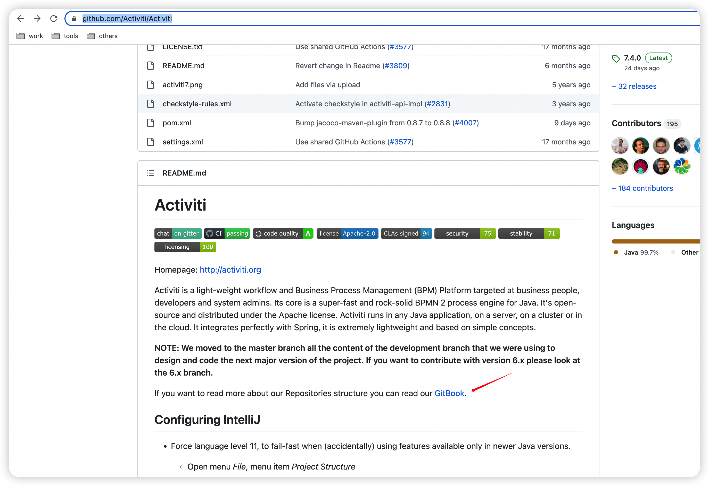
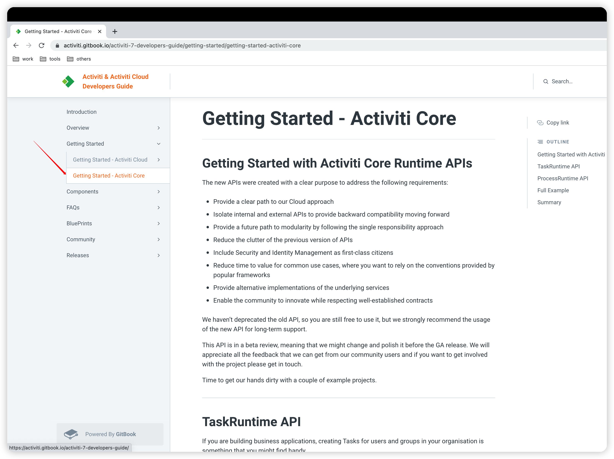
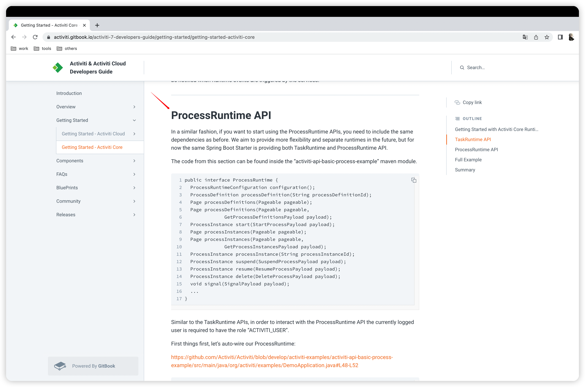
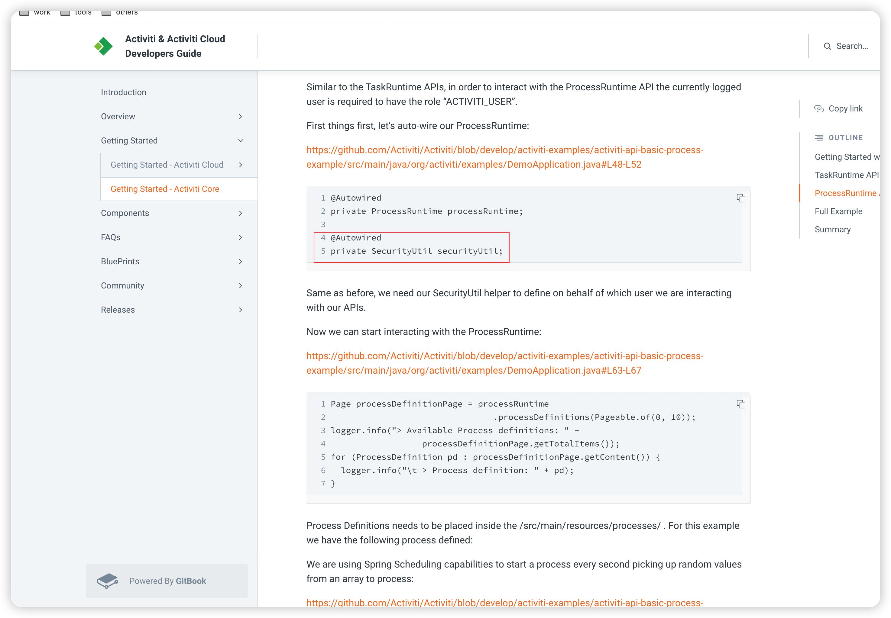
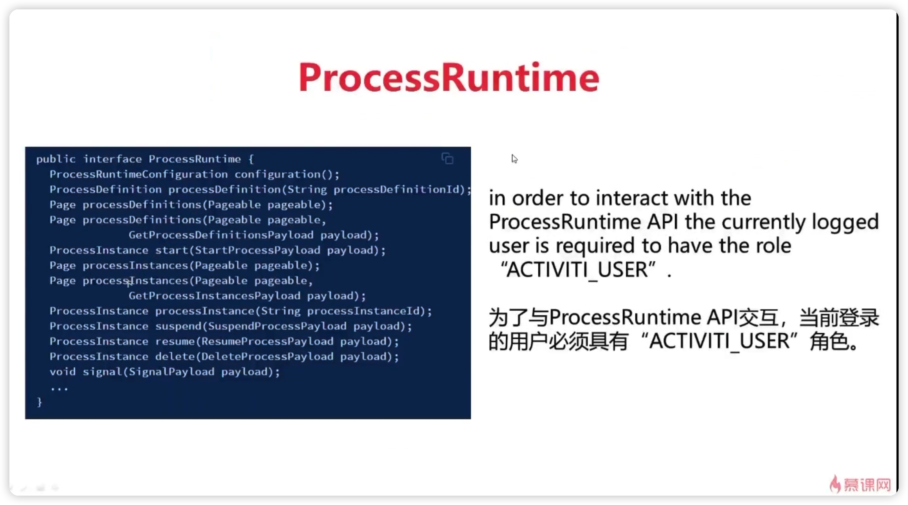
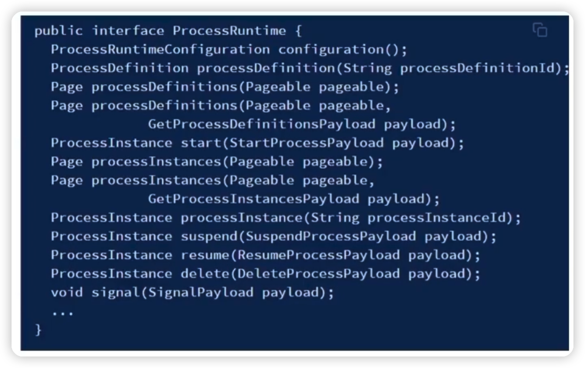
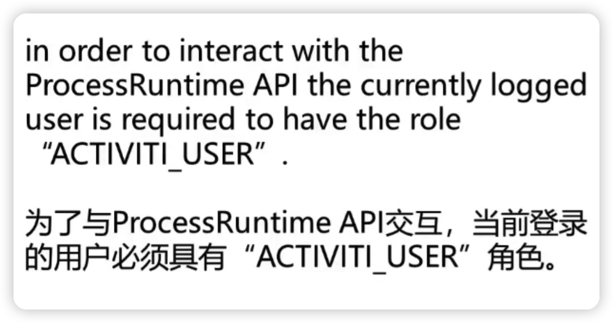
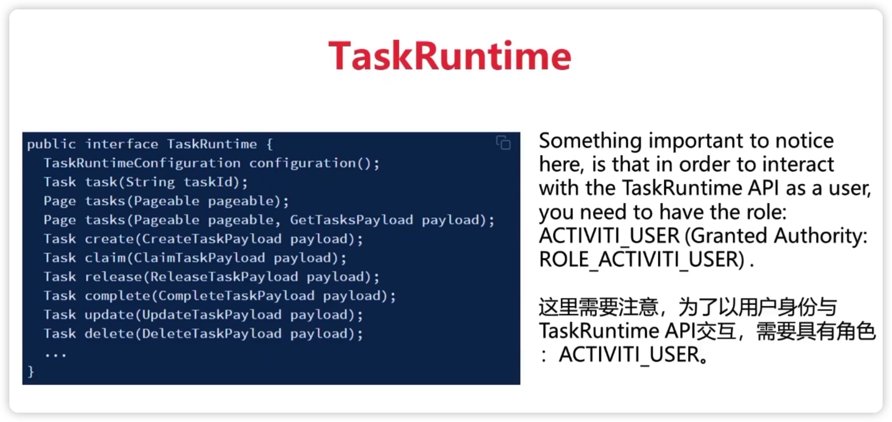
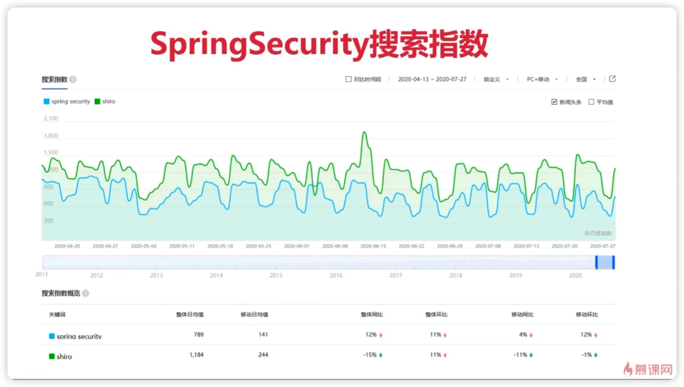

## 1、Activiti7在github上的地址

[Activiti7github地址](https://github.com/Activiti/Activiti)



+ 上面是有一个gitbook。
+ 点进去。



+ 在这个位置是存在一些api的介绍。



+ 下面是还存在一个ProcessRuntime Api
+ 这个是针对流程定义还有就是流程实例的一些控制。
+ 其次还增加了一个安全框架 -> SecurityUtil



## 2、本章内容

### 1、ProcessRuntime



+ 首先是会讲ProcessRuntime，然后再讲TaskRunTime
+ 这是两个新的类，两个新的类讲完之后，会去再讲解一些SpringSecurity相关的类。
+ 之后还会讲解一些BPMNjs的一些初始化和代码修改。
+ BPMNjs他是一个非常好的画BPMN的插件
+ 但是从官网直接下载是不能用的。
+ 他默认对Activiti是不支持的，要进行修改和配置，并且他默认也不是中文的。也需要进行修改和配置。

## 3、ProcessRuntime

+ 首先Activiti7他把之前学过的几个方法。
+ 学过的ProcessInstance ，Task他又进行了一次封装。
+ ProcessRuntime主要就是对流程定义，流程实例的一些操作。



+ 这里面是存在几个不同，第一他首先是定义了一个page属性。
+ Page属性可以返回流程定义，也可以返回流程实例。
+ 并且他又搞了一些StartProcessPayload类型。
+ 流程的挂起与激活，流程的删除都搞了一些对应的属性，里面封装了一些内容去进行操作。



+ ACTIVITI_USER是什么角色？
+ 之前在任务流转的环节只需要执行人写死就可以了。
+ 这个执行人在不在我数据库里面都没有关系，现在不是了，用户必须要在SpringSecurity里面有才能进行操作。

## 4、TaskRuntime



+ TaskRuntime是Activiti7中新出现的api， 它的作用像左边的图一样。
+ 对Task任务进行了封装， 支持了有Task的查询，Task任务的创建，Task的claim。以及Task的完成等等。
+ 相对来说这个TaskRuntime做的还是挺好的。 
+ 以前如果要查询，待办任务是一个方法，如果要查询候选人任务也是另外一个方法。
+ 把TaskRuntime给封装成一个方法了。
+ 这个是比较符合实际操作和人性的。
+ 并且TaskRuntime里面还做了一些异常判断。

## 5、SpringSecurity是Spring体系的一员

+ Activit7要是使用它的新特性的话，就必须使用SpringSecurity
+ 它是Spring家族中的安全领域的成员。
+ 在JavaWeb的安全领域，Sharo的使用频率要高于SpringSecurity。
+ 因为之前在SSM和SSH项目的整合中，要整合SpringSecurity是比较麻烦的事情。
+ 所以虽然SpringSecurity比Shiro要强大，但反而没有Shiro用的多。
+ 不过这个趋势在近几年有了明显的改观。
+ 自从是有了SpringBoot之后，SpringBoot对SpringSecurity提供了自动化的配置方案。
+ 只需要在创建项目的时候，勾选一下SpringSecuroty就集成了。
+ 并且SpringSecurity是可以支持SpringCloud微服务的。
+ 这些都不是Shiro可以比的。所以SpringSecurity的使用人数正在节节攀升。



+  可以看到这是某搜索引擎的指数
+ 可以看出来的是，Shiro的同比热度正在下降，但是SpringSecurity的同比热度正在上升。
+ SpringSecurity并不是一个没有人用的技术，反而他有机会可能称为安全领域的第一大安全框架。 

## 6、SpringSecurity的主要功能

### 1、认证

+ 顾名思义，要登录就要做认证，这一部分是重点。

### 2、鉴权/授权

+ 做的系统很多时候如果是在一个大项目里面，会可能存在给外部开放单点登录的使用场合。
+ 如果你不是做项目的总集，你只是做里头的一个子系统，那么你的用户和权限并不是在你做的这个系统里面管理的。
+ 而是在总集里面做的用户管理模块去管理的。
+ 那你做的系统就需要被其他需要访问的系统进行授权和鉴权。
+  那我如果把数据库的账号密码开放给它就可以了。
+ 但是这样来说的话是不安全的。

### 3、用户的三种来源

#### 1、application.properties

+ 这种是写死的，知道有这种配置就可以了。
+ 在项目中是不用的。

#### 2、代码中配置内存用户

```java
package com.activiti7.activiti7imoocdevelop;

import org.slf4j.Logger;
import org.slf4j.LoggerFactory;
import org.springframework.context.annotation.Bean;
import org.springframework.context.annotation.Configuration;
import org.springframework.security.core.authority.SimpleGrantedAuthority;
import org.springframework.security.core.userdetails.User;
import org.springframework.security.core.userdetails.UserDetailsService;
import org.springframework.security.crypto.bcrypt.BCryptPasswordEncoder;
import org.springframework.security.crypto.password.PasswordEncoder;
import org.springframework.security.provisioning.InMemoryUserDetailsManager;

import java.util.Arrays;
import java.util.List;
import java.util.stream.Collectors;

@Configuration
public class DemoApplicationConfiguration {

    private Logger logger = LoggerFactory.getLogger(DemoApplicationConfiguration.class);

    @Bean
    public UserDetailsService myUserDetailsService() {

        InMemoryUserDetailsManager inMemoryUserDetailsManager = new InMemoryUserDetailsManager();

        String[][] usersGroupsAndRoles = {
                {"salaboy", "password", "ROLE_ACTIVITI_USER", "GROUP_activitiTeam"},
                {"bajie", "password", "ROLE_ACTIVITI_USER", "GROUP_activitiTeam"},
                {"wukong", "password", "ROLE_ACTIVITI_USER", "GROUP_activitiTeam"},
                {"other", "password", "ROLE_ACTIVITI_USER", "GROUP_otherTeam"},
                {"admin", "password", "ROLE_ACTIVITI_ADMIN"},
        };

        for (String[] user : usersGroupsAndRoles) {
            List<String> authoritiesStrings = Arrays.asList(Arrays.copyOfRange(user, 2, user.length));
            logger.info("> Registering new user: " + user[0] + " with the following Authorities[" + authoritiesStrings + "]");
            inMemoryUserDetailsManager.createUser(new User(user[0], passwordEncoder().encode(user[1]),
                    authoritiesStrings.stream()
                            .map(SimpleGrantedAuthority::new)
                            .collect(Collectors.toList())));
        }


        return inMemoryUserDetailsManager;


    }


    //  @Bean
    public PasswordEncoder passwordEncoder() {
        return new BCryptPasswordEncoder();
    }

}
```

+ 这种就是在代码中配置的。
+ 好处是方便测试
+ 但是很明显一个问题就是在实际项目中，不会在代码中配置用户的。

#### 3、从数据库中加载用户

+ 这个就是要是用的方式。

### 4、本课程知识点

#### 1、内存登录改为数据库登录

#### 2、SpringSecurity配置文件详解

+ 哪些页面需要登录才能访问。
+ 哪些页面不需要登录。

#### 3、登录响应处理方案

+ 登录成功和登录失败的处理返回值。

## 7、BPMNJS

### 1、网址

+ [BPMNJS](https://bpmn.io/toolkit/bpmn-js)

