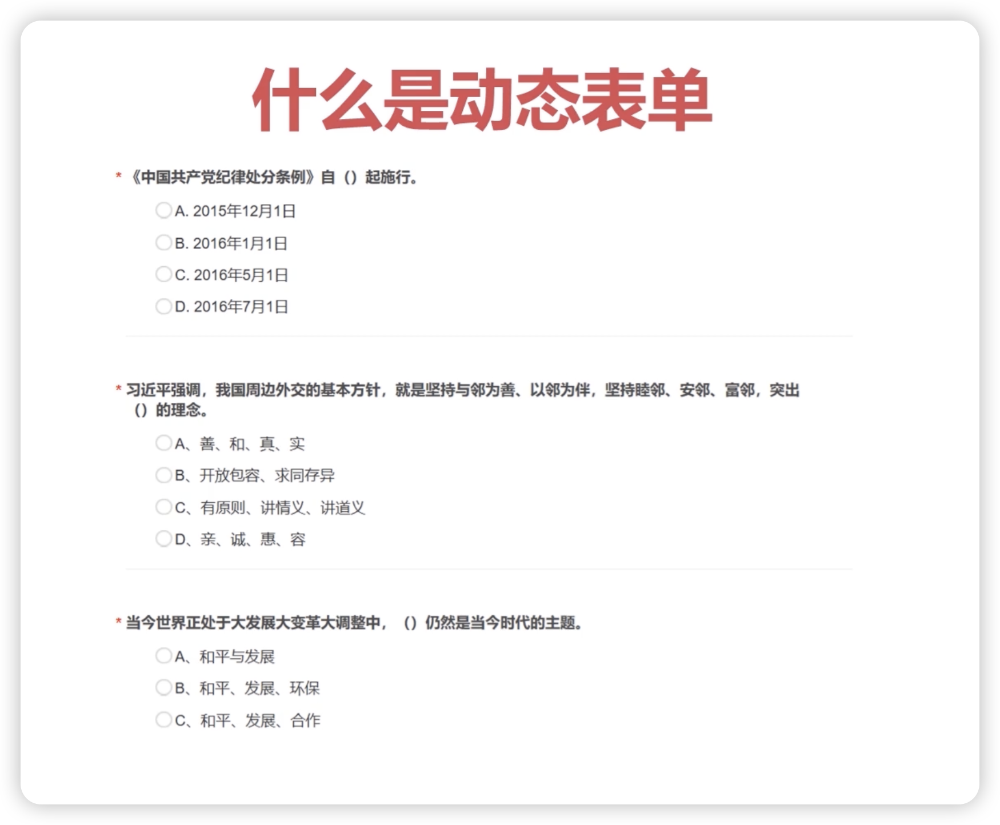
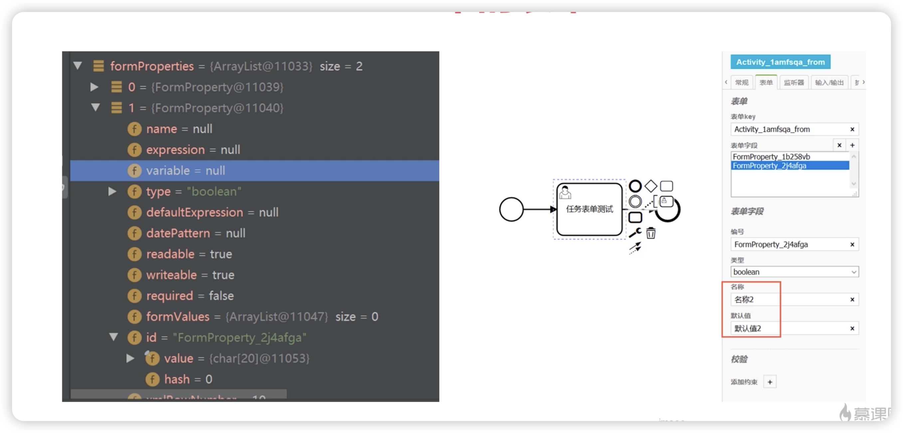

## 1、动态表单渲染方案

### 1、Activiti中的表单

#### 1、动态表单

> 动态表单是程序员最喜欢实现的表单方式，因为他的页面会根据数据的内容来描述出来

#### 2、普通表单

> 普通表单就是由前端一个一个去做静态的表单页面。

### 2、什么是动态表单？

> 动态表单要实现的是可以将数据描述渲染成页面的功能。
>
> 动态表单主要包括控件的类型，控件的数据，数据归属于哪一个业务流这三个要素。

+ 答题系统就是一个典型的动态表单的业务。

## 3、Activiti中的表单

+ 接下来要做这几件事情：
+ 首先要打开BPMNJS。在BPMNjs中呢，可以在表单对应的tab页，在表单字段里绘制一些内容。
+ 这些表单字段就相当于任务打开了之后，对应的页面里面每一个控件，绘制了这些控件之后。
+ 使用Activiti将这个流程定义部署一下，部署了之后启动流程实例，然后通过代码拿到这些表单字段。
+ 这就是主题内容。
+ 当然这中间存在很多的问题。
+ 首先在在Activiti7以前，就是在Activiti6和5是有from的属性的。
+ 可以通过from属性来存和读相应的表单字段。
+ 但是在7按照官网的说法，为了轻量化，去掉了这部分内容。
+ 那要怎么样读取表单字段呢？这就是需要说的内容。
+ 之后，表单字段要如何渲染。
+ 表单字段不光是说我定义了一个String类型的字段，像前端就显示一个输入框那么简单。
+ 他还有两个非常重要的事情，第一，字段是要有默认值的。
+ 这个默认值可能是一个固定值，也有可能是之前的某一个任务环节的填的值。
+ 在当前任务环节要显示。这个功能要显示。这也是动态表单要说的重要内容。
+ 还有一个功能是什么呢？
+ 经常在页面填写的时候填写的内容要作为uel表单的参数。
+ 比如说我请三天假，我请十天假是要经过不同的人审批，我在页面上填写的内容是要当做参数去做流程判断的。
+ 或者说下一个环节是由谁审批，是由这一个任务环节在操作人去选取的。
+ 那么选取的值也要作为UEL表达式的参数。那么这一部分功能要怎么做？这也是动态表单的一个重要的功能。

## 4、Activiti中的表单

### 1、动态表单

+ 使用拼字符串的方式描述表单信息

### 2、普通表单

+ 需要设置businessKey以及任务与表单一对一关系

## 5、Activiti表单字段约定内容

> 表单控件命名约束：FormProperty_0ueitp2-\_!类型-\_!名称-\_!默认值-\_!是否参数
>
> 说明：默认值：无、字符常量、FormProperty\_开头定义过的控件ID是否参数：f为不是参数，s是字符，t是时间(不需要int，因为这里int等价于string)
>
> 例子：FormProperty_0lovri0-\_!string-\_!姓名-\_!请输入姓名-\_!fFormProperty_1iu6onu-\_!long-_!年龄-\_!请输入年龄-\_!s
>
> 注意:表单Key必须要任务编号一模一样，因为参数需要任务key，但是无法获取，只能获取表单key“task.getFormKey()”当做任务key

## 6、Activiti动态表单的提交

### 1、解析提交的数据

### 2、提交表单内容写入数据库

### 3、参数数据作为UEL表达式参数

### 4、Activiti表单提交参数约定内容

> 动态表单提交内容约定：formData:控件id-\_!控件值-\_!是否参数!\_!控件id-\_!控件值-\_!是否参数
>
> 例子：FormProperty_0lovri0-\_!不是参数-\_!f!\_!FormProperty_1iu6onu-\_!我是参数-\_!s
>
> 是否参数：f为不是参数，s是字符，t是时间(不需要int，因为这里int等价于string)

